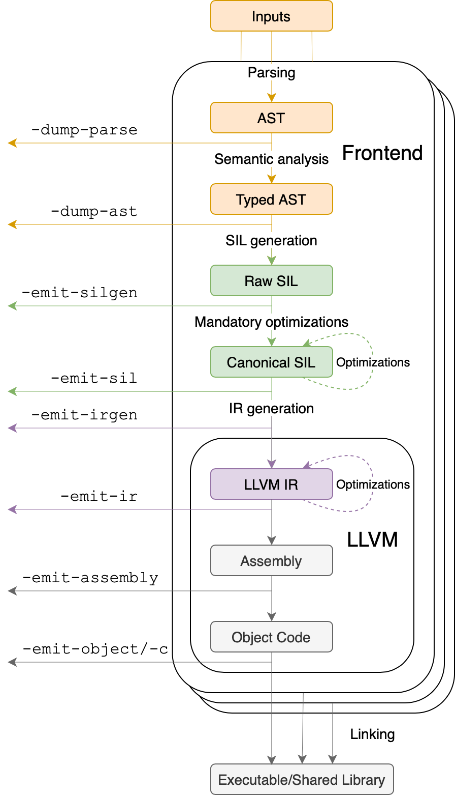
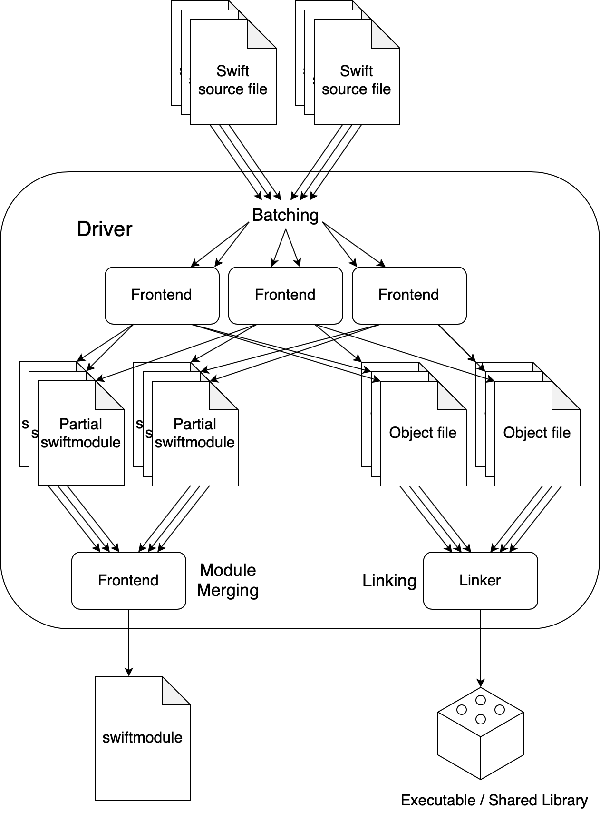

# Compiler Architecture

This document provides a high-level overview of the overall compiler architecture:
what the major components are,
and how they interact in different modes of use.

<!--
Non-Goals:
* Describe any single component in detail.
* Be 100% accurate.
-->

## Driver and Frontend

The compiler is conceptually divided into two main parts: the driver and the
frontend. When you invoke the compiler using
`swiftc <.swift source files> <flags>`, this creates a driver process which
spawns one or more frontend processes based on the _mode_ implied by the
flags.[1](#fn-clang-driver)
Compiler modes are described in detail later in this document.

All frontend processes spawned by the driver carry out a portion of the
compilation in parallel. When the frontend processes finish, the driver may
run additional merging jobs to combine their outputs. For example, when
compiling a module to an executable or a shared library, the driver invokes
the static linker to link the object files generated by different frontend
processes.

The following sections roughly focus on the frontend and the driver respectively.
The frontend is responsible for the bulk of the compilation, so its pipeline
is discussed first. After that, we discuss how different frontend processes
are orchestrated by the driver in different modes.

## Compiler Pipeline

<figure>
    
    <!-- <figcaption>A bird's eye view of the compiler pipeline.</figcaption> -->
</figure>

The figure on the right shows a bird's eye view of the compiler pipeline.

The colorful boxes represent conceptually different representations
of the program as it becomes increasingly low-level, ending in object code.
The arrows between them show major transformations.

The arrows marked as `-dump-parse`, `-dump-ast` and so on show commonly used
compiler flags which can be used to inspect the internal data structures between
different stages. For example, `-dump-parse` prints the AST before semantic
analysis and `-dump-ast` prints the AST after semantic analysis.

From the perspective of the Swift compiler, LLVM is mostly treated as a black
box. However, it is useful to understand what LLVM does in broad strokes.
LLVM is responsible for many low-level language-agnostic optimizations,
as well as translating the LLVM IR generated by the Swift compiler to
target-specific object code.

An important aspect of the compiler's architecture missing from the diagram
is laziness. In many cases, such as incremental builds, the compiler
will delay passes over entities until it actually needs some information, or
even skip them entirely.[2](#fn-skipped-parsing)
You can read more about the lazy architecture in
[docs/RequestEvaluator.md](../RequestEvaluator.md).

The following subsections go into more detail about the different
transformations. To work on the compiler,
you don't need to memorize the details of what each transformation does,
but it is helpful to have a rough understanding of where things roughly are.

<!-- Add transition line here? -->

### Parsing

<!--
Q: Where is "preprocessor" run?
-->

Parsing involves translating the source code into an AST.

The Swift compiler uses a hand-written recursive descent parser, similar to
many other industrial-strength compilers and unlike most parsers commonly
described in compiler textbooks.[3](#fn-operator-parsing)

### Semantic Analysis

Semantic analysis has two main responsibilities:
- Check different aspects of well-formedness of the program.
  - Expressions: This includes checking and inferring types for expressions,
    resolving names and overloads, checking availability and more. More details
    about type-checking expressions can be found in
    [docs/TypeChecker.rst](../TypeChecker.rst).
  - Protocols and generics: This includes resolving and checking validity of
    protocol conformances, checking if generic arguments conform to the
    necessary protocols, inferring associated types and more.
  - Patterns: This includes checking and inferring types for bindings and
    checking patterns for exhaustivity.
- Tree-rewriting:
  - Declarations and expressions are synthesized for language features such as
    automatic protocol conformance derivation, property wrappers and result
    builders.
  - Inferred types are attached to the AST for subsequent use.

Along the way, semantic analysis imports entities from C, Objective-C and
(experimentally) C++ headers as appropriate, to check the well-formedness of
Swift code.

### SIL Generation

SIL Generation (SILGen) generates _raw SIL_ by recursively traversing the AST.
This has several aspects:
- Bridging conversions and coercions are made explicit: At the AST level,
  `x as T` can represent a bridging conversion (such as
  `String <-> NSString`) or a coercion (such as converting an array of structs
  to an array of protocol existentials). Such expressions are made explicit at
  the SIL level. For example, coercing an array to a different array type may
  need to allocate a new array.
- Uncurrying method types and nested apply expressions: At the AST level,
  methods have curried `self`/`Self`. For example, an instance method's type
  looks something like `(Self) -> (ArgTypes...) -> ReturnType`. This is "fixed"
  during SILGen to be `(Self, ArgTypes...) -> ReturnType`.
- Tuples arguments are exploded into SSA registers:
- Argument conventions are decided (+1 vs +0):

<!-- Describe difference between raw SIL and canonical SIL. -->

<!--
SILGen
~~~~~~

SILGen produces *raw SIL* by walking a type-checked Swift AST.
The form of SIL emitted by SILGen has the following properties:

- Variables are represented by loading and storing mutable memory locations
  instead of being in strict SSA form. This is similar to the initial
  ``alloca``-heavy LLVM IR emitted by frontends such as Clang. However, Swift
  represents variables as reference-counted "boxes" in the most general case,
  which can be retained, released, and captured into closures.
- Dataflow requirements, such as definitive assignment, function returns,
  switch coverage (TBD), etc. have not yet been enforced.
- ``transparent`` function optimization has not yet been honored.

These properties are addressed by subsequent guaranteed optimization and
diagnostic passes which are always run against the raw SIL.
-->

### Mandatory Optimizations and Diagnostic Passes

After SILGen a deterministic sequence of optimization passes is run over the
raw SIL, emitting diagnostics for ill-formed code. These passes are simple and
predictable; this avoids major changes to compiler diagnostics with time.

- **Mandatory inlining** inlines calls to `@_transparent` functions.
- **Memory promotion** has two sub-parts:
  - Promotes heap allocations to stack allocations using capture analysis.
  - Promotes non-address-exposed stack allocations to SSA registers.
- **Constant propagation** folds constant expressions and propagates constant
  values, emitting a diagnostic if there is an overflow.
- **Return analysis** checks that typical functions return a value along every
  code path without "falling off the end", and that `noreturn` functions
  don't return.
- **Critical edge splitting** splits critical edges from terminators that
  don't support arbitrary basic block arguments
  (all non-`cond_branch` terminators).
  <!-- TODO: Should we remove this? Or can we explain it more simply? -->

If all these passes succeed, the final result is _canonical SIL_.

<!--
TODO:
- Basic ARC optimization for acceptable performance at -Onone.
-->

### Additional SIL Optimizations

SIL captures language-specific type information, making it possible to
perform high-level optimizations that are difficult to perform on LLVM
IR. Here are some of the optimizations that are performed on SIL:

- **Generic specialization** analyzes specialized calls to generic functions,
  generates specializations based on type arguments and rewrites calls to the
  generic function with direct calls to the appropriate specialization.
- **Witness and vtable devirtualization** looks up the associated method from
  a class's vtable or a type witness table and replaces the indirect virtual
  call with a call to the mapped function.
- **Performance inlining** identifies inlining opportunities based on heuristics
  and attributes in source code and inlines definitions, unlocking opportunities
  for further optimization.
- **Reference counting optimizations** include destroying balanced
  retain-release pairs, hoisting retain/release operations out of loops etc.
- **High-level domain specific optimizations** include special optimizations
  on currency Swift types such as `Array` or `String`. These require a defined
  interface between the standard library and the optimizer. For more details,
  see [HighLevelSILOptimizations.rst](/docs/HighLevelSILOptimizations.rst).

### IR Generation

### Linking

Object files are linked into an binary (a shared library or an executable)
using the platform linker.

## Compiler Modes

The compiler supports different options for how the driver can invoke the frontend
and orchestrate the build: these are called "modes".[4](#fn-compiler-modes)

### Primary-file mode

In primary-file mode, the driver divides the work it has to do between
multiple frontend jobs. Each frontend job independently emits partial results,
which are combined by the driver when all the frontends finish.[5](#fn-mapreduce)
The "independently" part is importantfrontend jobs do not exchange information
with each other. If a particular frontend job needs some piece of information,
such as "what is the parse tree for file X.swift" or "is there a type named Y
in this module", that frontend job will compute it.

For example, each frontend job itself parses all files in the module being
compiled, but it generates necessary outputs only for the primary file(s)
assigned to it. While processing the primary file(s), the frontend job lazily
analyzes definitions in secondary files as needed.

So there is some amount of work duplication: if there are `N` frontend jobs
and `M` files, the number of parse actions is `N * M`. However, certain work
is not duplicated: for example, method bodies are type-checked exactly once
as a method's declaration has enough information needed to be able to type-check
calls to that method.[6](#fn-method-signature)

<figure>
    
</figure>

Primary-file mode has two sub-modes:
- In the **single-file sub-mode**, the driver creates one frontend per file,
  with each frontend job having a single primary file.
- In the **batch sub-mode**, the driver creates a small number of frontend jobs,
  and each frontend job will (typically) process multiple files. The driver
  automatically determines the number of batches to create based on the number
  of cores available, but this can be overriden using the
  `-driver-batch-count <value>` hidden flag.[7](#fn-hidden-flags)

To make things more concrete, consider the diagram shown on the right.
It depicts batched compilation with 3 frontend jobs and 6 files.
Each frontend job has 2 primary files,
for which it generates a partial swiftmodule and an object file.
The driver spawns an additional frontend job to combine the partial swiftmodules
into a single swiftmodule.

### Whole-Module Optimization mode (WMO)

### Primary-file mode vs WMO

Primary-file mode's advantages are that the driver can do **incremental
compilation** by only running frontend jobs for files that are out of date,
as well as running multiple frontend jobs in **parallel**, making effective use
of multiple cores. Its disadvantage is that each frontend job reads all source
files in the module before focusing on its primary files. In the single-file
sub-mode, the amount of parsing work is quadratic in the number of files.
Usually, this is quite fast, but since it's quadratic, it can easily go wrong.
Using the batch sub-mode instead of the single-file sub-mode avoids this issue,
but it still leads to some amount of duplicated work being done.

In contrast, using WMO gives up on incrementality and frontend parallelism,[8](#fn-llvm-parallelism)
but provides the opportunity to do certain optimizations that need to be able to
look at the entire module.
TODO: Add example of such optimizations.
WMO can also increase the effectiveness of optimizations that are otherwise less
effective in primary-file mode.

In certain cases, using WMO can even be faster than primary-file mode despite
the lack of incrementality and reduced parallelism! For example, in modules with
a lot of private dead code, WMO can eliminate dead code earlier in the pipeline,
which means that the work of compiling that dead code from SIL to LLVM IR to
object code is skipped. Since a significant chunk of compilation time is
typically spent in LLVM, reducing the LLVM IR to be compiled can speed up
compile times more compared to an incremental and parallel build that needs to
compile a lot of LLVM IR.

## Footnotes

1. Clang has a similar design. Flags can be
  directly passed on the Clang frontend using `-Xclang`, similar to Swift's
  `-Xfrontend`. [↩](#fn1)
2. Delayed processing is not just an
  optimization; it is essential for certain language constructs such as
  `#if` blocks, specifically `#if compiler()` and `#if swift()`.
  In both these cases, the inactive side is not parsed. For other kinds of
  `#if` blocks, both the active and inactive sides are parsed, but only the
  active part goes through semantic analysis. [↩](#fn2)
3. One slight wrinkle here involves
  operators. Since Swift code may define new operators with custom fixity,
  associativity and precedence, it is not possible to correctly parse
  expressions containing operators without performing name resolution. Hence
  expressions containing operators are initially parsed as `SequenceExpr`s and
  re-parsed during semantic analysis. [↩](#fn3)
4. The terminology here may be slightly
  confusing; a "mode" in this section describes a particular form of interaction
  between the driver and one or more frontend processes, whereas the "modes" in
  the compiler's `--help` text (roughly) describe what work a frontend process
  should do before exiting. [↩](#fn4)
5. This architecture is a common pattern for
  parallel programs; it variously goes by the names split-apply-combine,
  map-reduce or scatter-gather in different contexts. [↩](#fn5)
6. This property isn't true for languages
  which allow omitting type signatures for function/method declarations.
  While Swift doesn't have this functionality, Swift does support omitting type
  signatures for stored properties with default values, which can lead to
  duplicate expression type-checking work across frontend jobs. [↩](#fn6)
7. Yes, the compiler has hidden flags! These
  are unstable -- they are not meant as public API -- and should not be relied
  on in projects that are not developed alongside the compiler. The driver's
  hidden flags can be seen using `swiftc --help-hidden`. The frontend also
  has hidden flags, which can be seen using `swift-frontend --help-hidden`.
  [↩](#fn7)
8. The "frontend" in "frontend
  parallelism" is important; the code generation part of the pipeline handled by
  LLVM is always multithreaded. [↩](#fn8)
