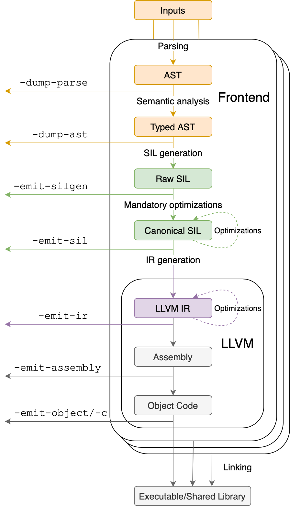
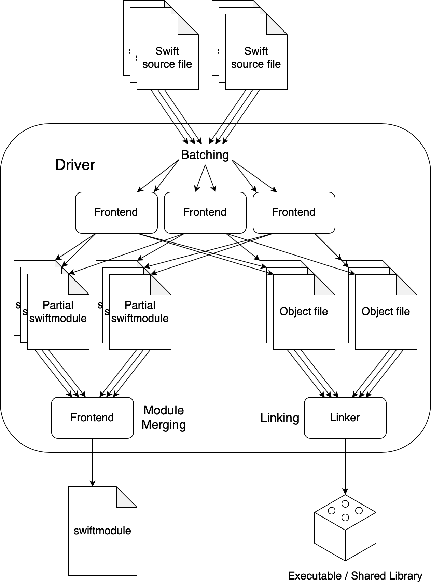

# Compiler Architecuture

This document provides a high-level overview of the overall compiler architecture:
what the major components are,
and how they interact in different modes of use.

<!--
Non-Goals:
* Describe any single component in detail.
* Be 100% accurate.
-->

## Driver and Frontend

The compiler is conceptually divided into two parts: the driver and the frontend.
When you invoke the compiler using `swiftc <.swift source files> <flags>`,
this creates a driver process which spawns one or more frontend processes
based on the _mode_ implied by the flags.
Compiler modes are described in detail later in this document.
The driver's responsibil
Each frontend process will generate one or more object files based on the Swift.
The driver will invoke the linker to link the object files into an executable
or a shared library.

## Compiler Pipeline

<figure>
    
    <figcaption>A bird's eye view of the compiler pipeline.</figcaption>
</figure>

Integer sit amet erat sagittis, dignissim turpis sit amet, gravida urna. Fusce sed vestibulum leo. Suspendisse laoreet nisi quis est vehicula, eu lobortis velit dictum. Nullam in nibh ut quam tristique malesuada. Proin sed risus sit amet quam pretium ornare. Nunc in lacus ut magna volutpat laoreet. Morbi feugiat nisi vel est congue, ut rhoncus felis vulputate. Aliquam erat volutpat. Phasellus euismod interdum elit, quis pretium nisl consequat ut.

Donec et dui cursus, condimentum mauris ut, porttitor ante. Donec sed mi fermentum, volutpat nisi sit amet, varius nibh. Nullam fermentum lacinia rhoncus. Curabitur ut sem odio. Nulla id lorem id metus finibus pulvinar. In tempus sagittis magna sed malesuada. Vestibulum non tellus elit. Maecenas pulvinar odio id eros convallis luctus. Donec placerat augue ipsum, a mollis elit vulputate et. Aenean a mauris semper, porta neque sed, molestie turpis. Sed in scelerisque est. Morbi sed rutrum lacus. Duis eu vehicula turpis.

Lorem ipsum dolor sit amet, consectetur adipiscing elit. Ut euismod sed risus vel sagittis. Class aptent taciti sociosqu ad litora torquent per conubia nostra, per inceptos himenaeos. Sed ut nisl ut lacus auctor sagittis sit amet rhoncus sapien. Mauris aliquet non tellus lobortis semper. Praesent hendrerit sit amet magna sed fringilla. Donec eu viverra eros. In nec nunc vitae justo feugiat sollicitudin. Phasellus convallis velit in facilisis volutpat. Donec orci diam, porttitor condimentum consequat at, sagittis non augue. Curabitur posuere luctus pharetra. Vivamus eget ligula in lacus vehicula porttitor sit amet non sem. Aliquam venenatis vehicula lacus, at interdum neque sagittis ut. Suspendisse potenti. Mauris vehicula est id aliquam dapibus. Donec in ornare ex. Nunc ultrices turpis eros, ac vehicula ligula euismod sagittis.

Nam nec ligula odio. Suspendisse dignissim id elit vel tincidunt. Integer sit amet tortor hendrerit, placerat enim a, sagittis nunc. Phasellus pretium erat et elit eleifend porttitor. Nam pulvinar imperdiet sapien nec semper. Interdum et malesuada fames ac ante ipsum primis in faucibus. Vestibulum consequat magna lectus, ut pellentesque ipsum porta nec. Aliquam nisl leo, porta et imperdiet ut, porta at ligula. Mauris vel lacinia sapien, vitae facilisis nisl. Praesent elit arcu, tincidunt at metus vitae, consequat pellentesque lorem. In magna lorem, posuere et diam in, pretium ornare quam. Cras ac diam eu mi facilisis hendrerit sed id tellus.

## Compiler Modes

This document describes

- Compiler pipeline
- Compiler modes

<figure>
    
    <figcaption>Module merging and linking in batch mode.</figcaption>
</figure>

Lorem ipsum dolor sit amet, consectetur adipiscing elit. Ut euismod sed risus vel sagittis. Class aptent taciti sociosqu ad litora torquent per conubia nostra, per inceptos himenaeos. Sed ut nisl ut lacus auctor sagittis sit amet rhoncus sapien. Mauris aliquet non tellus lobortis semper. Praesent hendrerit sit amet magna sed fringilla. Donec eu viverra eros. In nec nunc vitae justo feugiat sollicitudin. Phasellus convallis velit in facilisis volutpat. Donec orci diam, porttitor condimentum consequat at, sagittis non augue. Curabitur posuere luctus pharetra. Vivamus eget ligula in lacus vehicula porttitor sit amet non sem. Aliquam venenatis vehicula lacus, at interdum neque sagittis ut. Suspendisse potenti. Mauris vehicula est id aliquam dapibus. Donec in ornare ex. Nunc ultrices turpis eros, ac vehicula ligula euismod sagittis.

Nam nec ligula odio. Suspendisse dignissim id elit vel tincidunt. Integer sit amet tortor hendrerit, placerat enim a, sagittis nunc. Phasellus pretium erat et elit eleifend porttitor. Nam pulvinar imperdiet sapien nec semper. Interdum et malesuada fames ac ante ipsum primis in faucibus. Vestibulum consequat magna lectus, ut pellentesque ipsum porta nec. Aliquam nisl leo, porta et imperdiet ut, porta at ligula. Mauris vel lacinia sapien, vitae facilisis nisl. Praesent elit arcu, tincidunt at metus vitae, consequat pellentesque lorem. In magna lorem, posuere et diam in, pretium ornare quam. Cras ac diam eu mi facilisis hendrerit sed id tellus.

Cras lacinia magna ac nunc accumsan feugiat. Pellentesque quis odio sit amet ex rhoncus semper et id turpis. Suspendisse id dolor turpis. Nunc vel egestas magna. Aliquam non nisl ut tortor condimentum luctus. Mauris consectetur, ex non scelerisque ultricies, neque sapien sodales nisl, ac pharetra ligula nulla quis sapien. Duis id feugiat nisl. Nullam vitae neque bibendum, congue quam id, consequat tellus. Cras tincidunt turpis nisl, non varius enim fringilla nec. Mauris condimentum leo odio, sit amet pellentesque ex gravida ut. Vivamus et lacinia lorem. Maecenas consequat quam nunc, ac laoreet mauris suscipit a. Phasellus at aliquam odio, nec varius sem. Etiam quis lectus dui.

